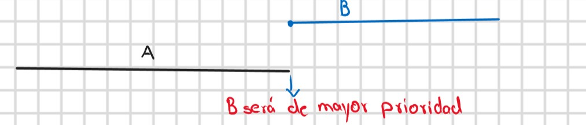
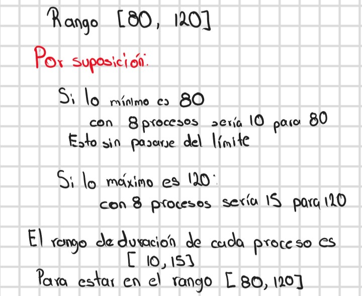
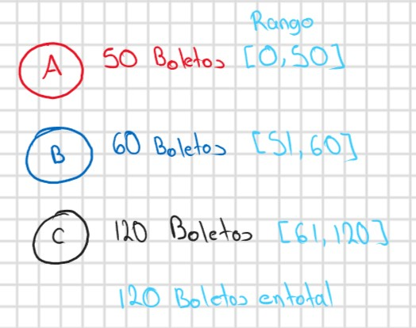
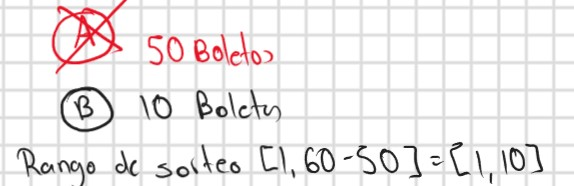
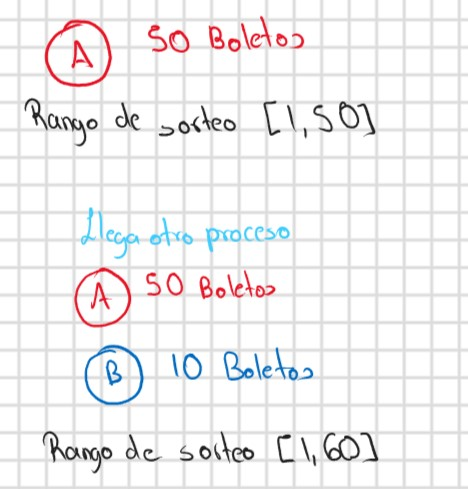

<h1 align='center'> Planificación por Retroalimentación Multinivel y por Lotería </h1>
 
<h2 align='center'> Planificación por Retroalimentación Multinivel</h2>

<h3><u>Overview:</u></h3> 
Este planificador únicamente se maneja para tener multitarea preventiva, no cooperativa.
  
La colocación del proceso en su respectiva cola será por medio del quantum, debido a que cada proceso se le estará  diciendo cuánto tiempo se va a ejecutar. Se van a crear varias colas de procesos, cada una tendrá diferente prioridad. 
El despachador estará tomando el proceso de la cola de mayor prioridad, manejando la estructura de selección FIFO. El proceso tomado pasa de ejecutado a listo ‘n’ veces, este es el parámetro. Una vez pasando estas 'n' ejecuciones el  proceso se degrada a la cola de prioridad inmediata inferior.  
Se define entonces:
<ul>
<li>n: Es la cantidad de ticks que se necesita para ser degradado a la cola de menor prioridad inmediata.</li>
<li>Q: Duración del quantum de las siguientes colas.</li>
</ul>
Por ende, se puede pensar, que mientras un quantum mayor a 'n', no se tendrá problemas debido a que la cantidad de ticks necesario para degradar a un proceso no va a ser restringido con respecto a la cantida de ticks restringido. O sea, que nosotros mientras n < q se tendrá que nuestro proceso va estarse ejecutando y no se va parar por q, sino que va a parar cuando la cantidad de ticks del proceso sea igual a n.  
En cambio, si nosotros ponemos q < n tendremos la situación que para que se haga un cambio de prioridad de cada proceso, o sea mover en otra cola, se tendrá que esperar a se complete esos n ticks, por ende aun cuando ya  no se haya llegado al tope de ticks de ese quantum se tendría que volver a escoger ese mismo proceso debido a que en realidad no se ha llegado a ese 'n' ticks necesario para bajar su prioridad.
  
En este enfoque se tendrá que n < q.
  
Lo que se estará entiendo es que en sí se iniciará siempre un primer proceso en 0, tal que este proceso estará comenzando con una prioridad de 0. Es de este manera que se tendrá.
  
<h3><u>Implementación</u></h3> 
El tema de esto es que se tiene que estar revisando cuando van llegando cada proceso, por ende estar revisando esto conlleva a su vez que al momento de que llegue se debe de poner en ejecución.
  
Lo que se debe de entender es que al inicio todos estarán en la cola de mayor prioridad, por ende la forma de diferenciarlos será por medio del tick de llegada, de tal modo que al llegar se tendrá que poner en ejecución debido a que se tiene una prioridad de la más alta, o sea 0 para nuestra implementación. El tema es que es necesario cuidar que mantener en mente que para que se pueda realizar este cambio de proceso es necesario que el proceso que estaba ejecutándose ya haya ejecutado sus ‘n’ ticks, debido al concepto de ‘n’ que será la cantidad de ticks que se deben de ejecutar para poder degradar el proceso. 
  
Pero aquí es donde surgen diferentes problemas acerca de la implementación, esto se debe a que no se sabe cómo reaccionar al momento de tener dos procesos con la misma prioridad. Esto se debe a que podemos estar ejecutando el proceso A, y supongamos que todavía a esas ‘n’ ejecuciones por lo cual todavía no se puede degradar, por ende qué ocurre si llega un proceso con la misma prioridad, ¿cuál debería de ejecutarse?, ¿se debe de mantener el proceso A?, ¿se debe de cambiar al proceso B? 
  
Como esto no fue aclarado por todo entonces se estará entendiendo que finalmente se tiene que cambiar al proceso B, debido a que este debe ser atendido para poder, al menos por un tick, para después degradarlo.
  
Para entender el cómo realizar en sí la implementación se debe de contemplar que en realidad lo que se tiene es que todo se puede manejar como un simple manejo de prioridad. Esto es debido a que al momento de siempre contemplar un cambio de procesos se debe de contemplar que esto es producido porque llega un proceso con menor prioridad o que al terminar sus ‘n’ ejecuciones este se degrada para después ejecutar otro proceso de mayor prioridad.
  
Es por esto mismo que se tendrá solamente dos condiciones para producir un cambio de proceso:
  
<ol>
<li>Cuando llegue un nuevo proceso, la prioridad del proceso actual será menor a la prioridad del proceso que llegó.</li>
<li>Cuando se haya alcanzado las ‘n’ ejecuciones se degrada el proceso y es cuando queda propenso a ser reemplazado por un proceso de menor prioridad.</li>
</ol>
 
No obstante, este cambio puede unificarse debido a que están directamente relacionados con la prioridad del proceso actual y el proceso que llega. Es por esto mismo que al momento de realizar una ejecución lo que se deberá de revisar serán dos cosas. 
  

  
<ol>
<li>Si llegó un nuevo proceso en ese tick, por ende se deberá de atender a ese.</li>
<li>En caso de tener ‘n’ ejecuciones entonces se deberá se degrada y se busca a otro con mayor prioridad.</li>
</ol>

Por ende, para hacer un poco más fácil el entendimiento de esto se decidió tener como n=1 y el quantum igual, será de esta manera que por cada tick habrá un decremento de la prioridad del proceso. De tal manera que se estará teniendo algo similar a lo presentado en el libro y clase donde se veía el ejemplo con n = 1. Y este así que voy a poder asegurar que el tiempo de llegada no va sufrir cambios, se mantendrá igual.
  
Finalmente, queda hablar acerca de la forma en que fue asignado el tiempo para la llegada y la duración del proceso. Para esto se contempló lo siguiente: 

<h3><u>Preguntas de retroalimentacion:</u></h3> 

<strong>¿Cómo se compararía este método con los otros abordados?</strong>

<ul>
<li>Ronda egoísta: En la ronda egoísta, cada proceso tiene un tiempo limitado de CPU, después del cual se pone en cola y se selecciona el siguiente proceso. Esta técnica es adecuada para entornos donde se requiere una respuesta rápida y se busca evitar la inanición, pero no garantiza una asignación justa de recursos.</li>
<li>FCFS: En FCFS, los procesos se ejecutan en el orden en que llegan, lo que garantiza una asignación justa de recursos. Sin embargo, los procesos con tiempos de ejecución más largos pueden bloquear los procesos más cortos, lo que provoca una posible inanición.</li>
<li>Round Robin: En el Round Robin, los procesos se ejecutan en intervalos de tiempo fijos. Esta técnica es adecuada para entornos con una carga de trabajo equilibrada, pero los procesos largos pueden tardar mucho tiempo en completarse.</li>
<li>SPN: En SPN, los procesos con el menor tiempo de ejecución se ejecutan primero, lo que garantiza una respuesta rápida y una alta utilización de la CPU. Sin embargo, los procesos largos pueden quedarse esperando en las colas y pueden experimentar inanición.</li>
</ul>

En comparación con estas técnicas, la planificación de retroalimentación multinivel tiene la ventaja de garantizar que todos los procesos se ejecuten en algún momento y evitar la inanición mediante la retroalimentación multinivel. Además, permite la priorización de procesos a través de múltiples colas de prioridad, lo que permite una mayor flexibilidad en la asignación de recursos.

Sin embargo, puede tener un tiempo de respuesta más lento debido a la necesidad de cambiar entre colas de prioridad y puede no ser la mejor opción para cargas de trabajo con requerimientos de tiempo real o que exigen un alto rendimiento.

<strong>¿Para qué tipo de carga es más apto y menos apto?</strong>

El planificador es adecuado para situaciones en las que hay una mezcla de cargas de trabajo y no se necesitan tiempos de respuesta extremadamente rápidos. Debido a que el proceso de planificación y ejecución de los procesos es un poco lento, ya que da prioridad a los procesos que llegan primero. Sin embargo, si se requieren tiempos de respuesta en tiempo real o un alto rendimiento, el planificador puede no ser la mejor alternativa.

<strong>¿Qué tan susceptible resulta a producir inanición?</strong>

El planificador tiene una estrategia multinivel de retroalimentación que evita la inanición, asegurando que ningún proceso quede esperando indefinidamente. Esto se logra promoviendo los procesos que han estado esperando durante mucho tiempo en las colas de baja prioridad a las colas de alta prioridad, de manera que todos los procesos tengan la oportunidad de ejecutarse en algún momento.

<strong>¿Qué tan justa sería su ejecución?</strong>

La equidad en la ejecución de los procesos depende de cómo se establezcan las prioridades. En este caso, se utiliza un enfoque que considera tanto el tiempo de llegada como la cantidad de ticks, lo que asegura que los procesos que llegan primero sean atendidos antes y los que han estado esperando sean ascendidos a colas de mayor prioridad. Aunque, este enfoque puede resultar injusto para procesos que necesitan más tiempo de ejecución, ya que tendrán una menor prioridad que los procesos más cortos.

<strong>¿Qué modificaciones requeriría para planificar procesos con necesidades de tiempo real? (aunque sea tiempo real suave)</strong>

Para planificar procesos con necesidades de tiempo real, se podría implementar una política de prioridad fija que garantice que los procesos con requerimientos de tiempo real tengan prioridad sobre los demás procesos. Además, se podría utilizar una técnica de planificación en tiempo real como EDF (Earliest Deadline First) o RMS (Rate Monotonic Scheduling) que garantizan la ejecución de los procesos dentro de sus límites de tiempo.

<strong>¿Alguna otra reflexión o inquietud que les provoque?</strong>

    
No

<h2 align='center'> Planificación por Loteria</h2>
<h3><u>Overview:</u></h3> 
	

	La planificación por lotería está basado en la popular forma de quitar dinero, una lotería o rifa de boletos. Esta planificación sigue las mismas bases que el juego, los participantes deberán de contar con por lo menos un boleto para poder participar, una vez que todos tengan boletos se podrá notar un comportamiento y es que algunos participantes por su deseo de ganar habrán adquirido más boletos para poder tener más probabilidad de tener el billete ganador. 
Cuando todos ya tienen sus boletos será hora de hacer la rifa, el sorteo del boleto ganador. Será por medio de un número que se tomará de forma aleatoria entre todos los boletos involucrados, de tal manera que el boleto que saque de ese sorteo será el boleto ganador. Posteriormente los involucrados en el sorteo deberán de checar si ese boleto es el correspondiente al que tienen, siendo el ganador aquel que posee el boleto premiado. Desde luego, aquellos que tienen más probabilidades de ganar son aquellos que tienen más boletos.
  
	Este código implementa el algoritmo de planificación de procesos llamado "planificación por lotería". En este algoritmo, se asigna a cada proceso un número de boletos y se realiza un sorteo para determinar cuál proceso se ejecutará a continuación. El proceso con más boletos tiene una mayor probabilidad de ser seleccionado, pero todos los procesos tienen una oportunidad de ser seleccionados.

	<h3><u>Implementación</u></h3> 
	
Ahora, en términos de implementación lo que se deberá de considerar es que la forma en que se estará definiendo una prioridad será por medio de la cantidad de boletos que tendrá cada proceso. Por ende, aquellos procesos que tienen más boletos será aquellos que resulten más beneficiados, tendrán mayor prioridad, mientras los que tienen menos boletos tienen menos prioridad. Es de esta manera que de forma aleatoria se estará asignando una cantidad aleatoria de boletos a cada proceso, esta cantidad puede ir desde 1 (cantidad mínimo de boletos para participar) a 1000 boletos.
	  
	De tal manera que el despachador tendrá que escoger un boleto entre todos los escogidos. No obstante, habrá una situación y es que al ser esto de forma aleatoria se puede tener el caso en donde boleto de mayor valor es el 800 y si escogemos de forma aleatoria entre 1 a 1000 obteniendo 900, no habrá forma alguna de escoger a alguien. Es por esto mismo que se estará sumando la cantidad de boletos que va teniendo cada proceso, de tal manera que al final se estará obteniendo una suma total en donde será que se deberá de tomar un boleto entre esa cantidad.
	  
	Ahora, supongamos que el boleto ganador es 100, ¿cómo sabemos qué proceso tiene el boleto 100? Esto es un poco extraño de visualizar, pero de cada proceso vamos a conocer la cantidad de boletos que tiene, más cuáles boletos son. Para poder obtener un rango lo que haremos será apoyarnos de los procesos junto con sus boletos. Para esto se ejemplificará por medio de la siguiente ilustración:
	 
	
	 
	De tal manera que se podrá observar que simplemente se hará una suma de la cantidad de boletos de cada proceso y por medio de esa suma vamos a poder conocer en qué rangos se va encontrar cada proceso y así saber qué boletos tiene cada proceso. Esta técnica tiene cierto parecido a prefix sum (suma de prefijos) para conocer sumas en rangos de un arreglo de números.
	  
	
	 
	Es de esta manera que podremos conocer a qué proceso pertenece el boleto ganador. Lo siguiente es definir el comportamiento.
	  
	Cuando se escoja al proceso ganador, éste va a proceder a ejecutar un quantum, de tal manera que va ejecutar todo el quantum sin ser interrumpido, no importa si en ese momento va llegando un proceso, el inicio de ese proceso se verá aplazado hasta que llegue.
	  
	Ahora, ¿qué pasa con los boletos de aquellos procesos que terminen? Bueno… hay diferentes formas de abordar el problema, debido a la premisa que mientras no se especifique algo tenemos total libertad para abordarlo. No obstante, lo que es necesario ver es que al quitar ese proceso que ya no se vaya  contemplar, debido a que fue terminado, ya podemos ignorar esos boletos, de tal manera que debido a la naturaleza de cómo es definido los rangos de cada proceso, podemos limitar la elección del boleto ganador entre la cantidad de boletos total que se tiene de los procesos que queda sin terminar. Es de esta manera que no será necesario pelearnos con implementaciones de reasignación de boletos, simplemente estamos redefiniendo el rango de elección y conservando la prioridad de los procesos restantes.
	  
	
	 
	Una vez comentado lo anterior, podemos observar que simplemente es necesario mantener siempre la cantidad total para definir el espacio donde se realizará el sorteo. Por ende, esto mismo lo podemos utilizar para declarar aquellos procesos que van llegando, de tal manera que cuando van llegando simplemente podemos ir modificando la cantidad de boletos totales según sea la cantidad de boletos que tiene cada proceso. De modo que si nosotros solo tenemos un proceso, A, entonces se va tomar siempre un número entre 1 a la cantidad de boletos que tiene ese proceso A, por ende siempre se va escoger este, al menos que llegue otro proceso, y esto de todos modos queda sujeto en el sorteo.
	  
	
	

    <h3><u>Preguntas de retroalimentacion:</u></h3> 
	
<strong>¿Cómo se compararía este método con los otros abordados?</strong>

	<ul>
		<li>En comparación con la ronda egoísta, la planificación de lotería es más justa ya que todos los procesos tienen la oportunidad de ser seleccionados para la ejecución, independientemente de su tamaño. En la ronda egoísta, los procesos más grandes pueden acaparar la CPU y retrasar la ejecución de procesos más pequeños.</li>
		<li>En comparación con FCFS, la planificación de lotería es más justa y evita la inanición, ya que cada proceso tiene al menos un boleto y, por lo tanto, una oportunidad de ser seleccionado para la ejecución. </li>
		<li>En comparación con el algoritmo Round Robin, la planificación de lotería es más justa y puede evitar la inanición, pero también puede ser menos eficiente computacionalmente debido al proceso de selección de lotería. En Round Robin, todos los procesos tienen una oportunidad equitativa de ejecutarse y no hay inanición, pero puede haber problemas de latencia debido al pequeño intervalo de tiempo asignado a cada proceso.</li>
		<li>En comparación con el algoritmo SPN, la planificación de lotería es menos eficiente en términos de tiempo de respuesta y puede no ser adecuada para cargas de trabajo de tiempo real. SPN prioriza los procesos más cortos, lo que puede reducir el tiempo de respuesta global del sistema. En la planificación de lotería, los procesos más pequeños tienen más boletos, pero aún pueden tener que esperar su turno si hay muchos procesos grandes en la cola.</li>
	</ul>
	
<strong>¿Para qué tipo de carga es más apto y menos apto?</strong>

	
La planificación por lotería es una buena opción para distribuir cargas de trabajo con procesos de distintos tamaños, ya que cada proceso recibe una cantidad de boletos que determina su probabilidad de ser elegido para la ejecución. Por lo tanto, sirve de una mejor manera en situaciones en las que la carga de trabajo es heterogénea. Sin embargo, este algoritmo podría no es tan efectivo cuando se manejan cargas de trabajo con muchos procesos, ya que el proceso de selección puede ser computacionalmente costoso.

	
<strong>¿Qué tan susceptible resulta a producir inanición?</strong>

	
El algoritmo de planificación de lotería es menos susceptible a producir inanición en comparación con otros algoritmos, ya que cada proceso tiene asignado al menos un boleto,, lo que le otorga una probabilidad de ser seleccionado para la ejecución. Por lo tanto, incluso los procesos con menos boletos tienen la oportunidad de ejecutarse.

    
<strong>¿Qué tan justa sería su ejecución?</strong>

    
Se considera que la planificación por lotería es equitativa porque cada proceso tiene una probabilidad proporcional a la cantidad de boletos asignados para su ejecución. Por lo tanto, un proceso con más boletos tendrá una mayor probabilidad de ser seleccionado, pero siempre existe la posibilidad de que un proceso con menos boletos sea elegido. Sin embargo, la justicia de la planificación por lotería puede verse comprometida debido a la asignación inicial de boletos a cada proceso, que puede ser tendenciosa.

    
<strong>¿Qué modificaciones requeriría para planificar procesos con necesidades de tiempo real? (aunque sea tiempo real suave)</strong>

    
La planificación de lotería no se considera adecuada para estos procesos debido a que no garantiza que un proceso se ejecute en un momento determinado. Una posible modificación consistiría en asignar un número de boletos proporcional a la prioridad del proceso, de manera que los procesos de tiempo real tendrían una prioridad más alta y, por lo tanto, más boletos.

    
<strong>¿Alguna otra reflexión o inquietud que les provoque?</strong>

    
No

