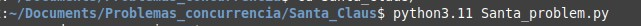
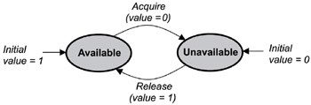

<h1 align='center'> Problema: Santa Claus </h1>

<h2><b>Preview</b></h2>
<hr><br>
<div align='center'>

</div>
<hr><br><br>

<div align='justify'>
<p>
<h3><u>Información de valor para entender el problema y sus requerimientos</u></h3><br>
Santa Claus estará dormido y solo hay dos factores que harán despertarlo:
<br><br>
<ol>
<li>Exactamente tres elfos deben tener tres dudas (esto se simplifica a solo tres elfos), pueden despertar a santa Claus por ayuda.</li>
<li>Sus renos pueden despertarlo para su viaje anual.</li>
</ol>
<br>
Se puede tener cualquier cantidad de elfos que necesiten ayuda por parte de Santa Claus al momento de estar construyendo los juguetes, no obstante lo único importante es que se deberá de siempre tener en mente que solo tres en tres elfos pueden despertar a Santa Claus. En caso de que sean más o menos elfos, entonces se dejará dormir a Santa.
Son nueve renos, se encuentran de paseo pero en algún momento volverán al polo norte para el gran viaje.
<br><br>
Entonces, el comportamiento que deberá de tener el programa será que estará considerando mientras Santa Claus esté durmiendo, después evaluar el comportamiento de cuando despierte teniendo dos situaciones de las cuales se desprenden más situaciones. 
<br><br>
<i>Situación 1</i>
<hr>
Tener una cantidad menor a 3 elfos, en ese caso no será posible despertar a Santa Claus, sino que se mantendrá dormido.
<br><br>
<i>Situación 2</i>
<hr>
Tener una cantidad de elfos mayor a 3, en dicho caso será posible despertar a Santa Claus, aunque claro está que no podrán preguntarle todos esos elfos, sino que solo 3, por lo tanto que de esa cantidad simplemente se escogen los 3 primeros que tuvieron una duda. Lo demás elfos queda esperando fuera de la habitación de Santa Claus.
<br><br>

Sea cuál sea la situación, se deberá de contemplar que se puede tener cualquier cantidad de elfos, por ende puede ser de 1 hasta una ‘n’ cantidad.
<br><br>
<h3><u>¿Pero qué pasa con los renos?</u></h3>
<br>
El manejo de los renos se considerará que estos inicialmente estarán de vacaciones, por ende estarán llegando de sus vacaciones poco a poco. No se tiene muy claro si llegan todos en conjunto o llegan por separados, por ende se va a considerar que llegan de poco a poco, por ende al llegar al polo norte y ver que todavía no han llegado los 9 renos, este reno que ha llegado se va disponer a descansar en el establo de Santa.
<br><br>
Es por esto mismo que el comportamiento que tendrán los renos en el programa es que van a llegar, después se deberá de checar si ya han llegado todos los renos, y será este reno quien podrá escoger entre dos opciones basado en la situación:
<ul>
<li>Si con él ya han llegado todos los renos, este último va y despierta a Santa Claus para preparar todo respecto al viaje anual.</li>
<li>En caso que todavía no hayan llegado todos los renos, entonces el reno actual se va a descansar en el establo.</li>
</ul>
<br><br>
Importante mantener en mente que solo serán 9 renos los que tiene Santa Claus.
<br><br>
<h2>¿Qué comportamiento tendrá Santa?</h2>
<hr><br>
Este será definido por las situaciones descritas arriba, solo se podrá despertar santa si se tiene un grupo de 3 elfos o si han llegado todos los renos para iniciar con el gran viaje anual. Santa desde un inicio estará dormido y solo será despertado por el último elfo que llegó al grupo para preguntar, o por el último reno que llegó de sus vacaciones.
<br><br>
Al momento que Santa despierte tendrá dos diferentes comportamientos según sea quién lo despertó. Estos comportamientos quedan definidos de la siguiente manera.
<br><br>
<h3><u>Si fue un elfo</u></h3>
En este caso Santa deberá de levantarse y brindar una asesoría a los tres elfos pertenecientes al grupo. Una vez que acabe y los elfos reciban esa ayuda, Santa va a proceder a dormir de nuevo. En ese instante los 3 elfos deberán de retirarse del lugar donde se encuentra Santa, para después el último elfo deberá de avisar a los demás elfos que ya puede pasar otro grupo, es por ello que en ese instante otros tres elfos con dudas deben de empezar a formar otro grupo de 3 elfos.
<br><br>
<h3><u>Si fue un reno</u></h3>
Al llegar el último reno, este mismo será el encargado de ir con Santa Claus para despertarlo. Una vez despierto, Santa deberá de preparar a los renos y une vez que cada reno (de los 9) se encuentre ya preparado, Santa iniciará con el gran viaje anual. Una vez que regrese del viaje va a volver a dormir, mientras que los renos se vuelven a ir de vacaciones a las playas del Caribe.
<br><br>
En este punto, se ha abarcado todo el comportamiento que tendrá nuestro programa, ahora comienza la explicación técnica del mismo.
<br><br><br>
<h2>Lenguaje y entorno de desarrollo</h2>
<hr>
Originalmente, tenía planeado desarrollar el programa en C, no obstante debido a la facilidad de lectura y fluidez de escritura que proporciona Python, me decidí por este último.
El problema fue resuelto usando el lenguaje de programación Python 3.11.
<br><br>
Por otro lado, el entorno donde fue programado fue en la distribución de Linux (basada en Ubuntu y Debian) Linux Mint. El código fue interpretado en tiempo de ejecución desde la terminal de Linux Mint usando python 3.11.
<br><br>
El editor de código usado fue Visual Studio Code.
<br><br>
<h2>¿Qué se tiene que saber o hacer para ejecutar el programa?</h2>
<hr><br>
<ol>
<li>El programa fue desarrollado en python 3.11.</li>
<li>Se recomienda un tamaño de la terminal de 147x24.</li>
</ol>
<br><br>
Después de lo descrito arriba, solamente queda escribir el comando para ejecutar el programa:
<br><br>
<div align='center'>

</div>
<br>
Lo más destacable es la versión de python, siendo esta la más reciente al momento de la elaboración del programa, Python 3.11. 
<br>
Al momento de ejecutar se podrá observar el comportamiento del programa, y para parar la ejecución será solo necesario usar el comando ctrl+C. 
<br>
Para tener una mejor visión de los enunciados del programa es recomendable adaptar a la <b>terminal en un tamaño de 147x24</b>.
<br><br>
Tal vez lo mejor sería implementar un hilo que esté funcionando con una suerte de evento para parar el programa de una forma más elegante, tal que este hilo esté a la espera de que una tecla sea presionada para finalizar. Pero como no se hizo mención alguna de este apartado, consideré que lo mejor sería que se quedara así.
<br><br>

<h2>La estrategia de sincronización – Primitiva de sincronización usada</h2>
<hr><br>
La primitiva e sincronización usada fue el semáforo, esto con la finalidad de poder manejar bloqueos de los hilos y emplear los patrones vistos en clase. Escogí esta primitiva debido al hecho que nos permite mandar a bloquear un hilo y evitar la espera activa u ocupada de este mismo. Esto se puede entender mejor por medio de la siguiente imagen.
<br><br>
<div align='center'>

</div>
Aunque esta imagen más parece que es el funcionamiento gráfico de un mutex.
<br><br>
Por ende, al tener la oportunidad de poder manejar tres operaciones en un semáforo:
<ol>
<li>Inicializar</li>
<li>Incrementar</li>
<li>Decrementar</li>
</ol>
Lo que hice fue observar que el empleo de los semáforos como binarios o como semáforos enteros, me daba la oportunidad de poder emplearlos para reforzar el acceso de datos compartidos (uso directo de un mutex en la zona crítica) y además poder usarlos para ir colocando los procesos que faltaban  bloquearlos, tal que se vayan formando en la cola de procesos, y esto fue de mucha ayuda debido a que la interpretación de número negativos en un semáforo es la cantidad de hilos bloqueados y que están esperando que CPU les dé de su tiempo. Y cuando se tenga valores positivos significa que es posible que los procesos actuales que accedan el CPU les pueda dar de su tiempo. Y esto es simplemente incrementando y decrementando el valor inicial. Claro que no se podrá consultar los valores o estados del semáforo, pero esa idea abre a la percepción de usarlos para mandar y aplicar los diferentes patrones vistos para la resolución del problema actual.
<br><br>
Una vez aclarado que la primitiva de sincronización será el semáforo, se podrá pasar ahora sobre la estrategia y patrones usados.
<br><br>
<h2>La estrategia de sincronización – Mecanismos y patrones usados</h2>
<hr><br>
Los patrones usados fueron:
<ul>
<li>Mutex</li>
<li>Barrera</li>
<li>Torniquete</li>
<li>Señalizar</li>
</ul>
Su uso será explicado a continuación.
<br><br>
<h3><u>Librerías usadas</u></h3>
De forma inicial se estuvo colocando las respectivas librerías que serían usadas:
<br><br>

```python
#Librerias utilizadas
import threading        # Manejo de hilos
import time             # Manejo de tiempo, principalmente sleep

import colorama         # Para colores!!
from colorama import Fore
from colorama import Style
```

<br><br>
Las más importante son las de threading y time, estas librerías fueron utilizadas para la creación de hilos, semáforos y el manejo de dormir (simulando un tiempo de trabajo), de forma respectiva.
<br><br>
Por otro lado, la otra librería llamada colorama fue usada para poder poner los textos de diferentes colores, esto con el único objetivo de tener una mejor experiencia visual al momento de visualizar el comportamiento del programa.
<br><br>

<h3><u>Semáforos usados</u></h3>
<br>
Inicialmente se tuvo los siguientes semáforos:
<br><br>

```python
# Semaforos que seran usados
mutex_checkVar = threading.Semaphore(1)
elfos_semaforo = threading.Semaphore(1)
renos_semaforo = threading.Semaphore(0)
Santa_semaforo = threading.Semaphore(0)
```

<br><br>
No obstante se fueron añadiendo más para permitir el manejo de otras situaciones que me fui encontrando en el camino y serán explicadas más adelante:
<br>

```python
torniquete = threading.Semaphore(0)

signaling_messages = threading.Semaphore(0)     # Un semaforo para controlar flujo de mensajes. 
mutex2 = threading.Semaphore(1)

mutexRenos = threading.Semaphore(1)
mutexElfos = threading.Semaphore(1)
```

<br><br>
Finalmente, se usó variables enteras para llevar la cuenta de cuántos elfos y renos llevábamos.
<br>

```python
# Contadores
elfos_count = renos_count = 0
n = 0
```

<br><br>
Esa variable ‘n’ cobrará más sentido conforma se vaya avanzado.
<br><br>
<h3><u>Ahora sí, la lógica</u></h3>
<br>
Para que fuera más entendible el programa decidí agregar los respectivos enunciados y descripciones de acciones que harían tanto santa, los elfos y los renos. Pero decidí implementarlo por medio de funciones y así evitar tener un print combinados con la lógica, lo cual siento que dificultaría la lectura del código:
<br>

```python
# ---------------------------
# -- Funciones de mensajes --
# ---------------------------

def santa_despierta():
    print("*Bosteza* \U0001F385 Ho! Ho! Ho! Estoy despierto.")

def preparar_renos():
    print("*Santa empieza a preparar los renos*")

def santa_estado():
    print("\n\t\t\t* Santa se encuentra dormido actualmente * \U0001F6CC\n")

def inicio_viaje():
    print("\t\t\t\t *Santa inicia el viaje*  \U0001F30E \n\t      \U0001F384      \U0001F381 F e l i z  N a v i d a d !   H o !   H o !   H o !  \U0001F381")

def ayudar_elfos():
    print("\t\tEn que les puedo ayudar?         *Empieza asesorar*")

    .
    .
    .
    #etc
```

<br><br>
<h3><u>Comportamiento de Santa</u></h3>
<br>
Como se comentó, Santa tendrá solo dos situaciones en donde será despertado:
<br><br>
<ol>
<li>Cuando hayan llegado los 9 renos de sus vacaciones.</li>
<li>Cuando se tenga los 3 elfos reunidos en un grupo para preguntar.</li>
</ol>
<br>
Para atender cada uno se hizo uso de las variables que estarán contando, y esto fue por medio de un <i>if</i>, tal que al momento de tener 9 renos o los 3 elfos se podrá saber por medio de los contadores. Ahora, en el orden de la prioridad se tendrá primerio a los renos, debido a que si llegan todos los renos y también se tiene ya un grupo de 3 elfos, Santa va a tener que atender primero a los renos, debido a que ya tiene que hacer el viaje anual antes de que se haga tarde. En esta situación, los elfos pueden esperar pero los renos no.
<br><br>
Se tiene que el acceso a estos contadores se estará tratando de variables compartidas, o sea un acceso compartido entre santa con los renos y elfos, por el mismo se tiene que es una zona crítica y la cual debe de protegerse para que no tener alguna condición de carrera debido a que muchos hilos intenten acceder y modificar esta zona crítica al mismo tiempo. Para evitar esta condición de carrera se optó protegerlo por medio de un mutex, también conocido como semáforo binario o candado.
<br><br>
En un inicio se tendrá el mutex con 1, al tener valor positivo se estará entendiendo que un hilo o proceso puede ocupar tiempo del CPU, así que puede entrar pero una vez entrando este valor ahora es 0 lo cual se interpreta como que ya hay un hilo ocupando el CPU, así que otro hilo que intente entrar a esta zona lo que hará será decrementar el valor lo cual al tener un semáforo con valores negativos pues se estará entendiendo que es la cantidad de hilos que están en la cola de procesos. Es de esta manera que solo me estoy asegurando que un hilo de santa pueda afectar o hacer uso de estas variables compartidas.
<br><br>

```python
# -----------------------------
# -- Comportamiento de Santa --
# -----------------------------
'''
Se tiene primero a Santa, se contemplas las dos unicas acciones que lo pueden despertar:
    1. Los 9 renos han llegado al polo norte.
    2. Hay exactamente 3 duendes que necesitan de la ayuda de Santa Claus
'''

def santa_claus():
    global renos_count,Santa_semaforo,mutex_checkVar,renos_semaforo,elfos_count,elfos_semaforo,n,torniquete,signaling_messages
    santa_estado()
    Santa_semaforo.acquire()       # Se encuentra bloqueado en un inicio, hasta que una condicion lo saque de bloqueados

    mutex_checkVar.acquire()       # Hay que forzar una exclusividad mutua de acceso
    if renos_count ==  9:          # Por prioridad, se checa la cantidad de renos.
        elfos_semaforo.acquire()   # Se debe de bloquear el paso de grupo de dudas ya que santa esta preparando a los renos. 
        
        espacio()
        santa_despierta()
        preparar_renos()
        n = 0

        renos_semaforo.release(9)
        renos_count = 0
        signaling_messages.acquire()

        inicio_viaje()
        santa_regresa()            # Santa se va a vacaciones
        renos_vacacionar()         # Los renos se van de vacaciones
        espacio()

        elfos_semaforo.release()

    else:
        if elfos_count == 3:         # En este caso se tiene 3 elfos que preguntan algo
            espacio()
            santa_despierta()
            ayudar_elfos()
            torniquete.release()     # Se deja pasar al grupo de 3 elfos
            signaling_messages.acquire()
            santa_duerme()
            espacio()
    mutex_checkVar.release()
```

<br><br>
Primero, en la parte de renos, lo primero que deberá hacer santa es dormir por lo tanto se tiene un semáforo de santa con un valor inicial de 0 para que al inicio Santa se encuentre dormido y esto lo sabemos por medio de ese mensaje. Como Santa se encuentra dormido en un inicio no va avanzar más en su ejecución, y solo lo hará una vez que lo levante los renos o los elfos y esto se hace por medio de un relase del semáforo de Santa Claus.
<br><br>
Supongamos que lo levanta un reno, en ese caso significa que ya han llegado todos los renos, por lo tanto Santa deberá de bloquear el paso de grupos de elfos y preparar a los renos, para esto lo que se hace es tomar decrementar el valor del semáforo de elfos con el objetivo que al decrementar y en el caso que se tenga ya los 3 elfos o sigan llegando, estos no van a poder seguir avanzando debido a que al llegar al semáforo de elfos estos hilos se van a ir directo a la cola de procesos bloqueados. Hasta finalizar y regresar del viaje se incrementará el valor del semáforo de elfos. Este mecanismo se puede entender como una aplicación de otro mutex, pero sin limitarnos a valores 0 y 1, sino solo aplicar el concepto de candado para impedir que los hilos de los elfos puedan avanzar.
<br><br>
Finalmente, después de mandar a esperar a los elfos, ya podemos pasar a los mensajes de parte de santa y se colocará la variable ‘n’ en 0, esto es debido a que la variable ‘n’ me va servir como un contador para saber si ya todos los renos están listos para el viaje. Posteriormente se incrementa 9 en el valor del semáforo de renos con el objetivo que ya los renos que se fueron a dormir despierten y se preparen para el viaje, por lo tanto también se pone su contador en 0 y esto se debe a que la cantidad de renos que se tiene en el establo ahora es 0.
<br><br>
De forma adicional, se agregó un semáforo que estaré utilizando como un patrón de signaling, esto lo hice para poder mantener un orden en las acciones, ya que para que Santa pueda realizar la acción de iniciar el viaje, forzosamente debe de esperar a que los renos se encuentren listos y preparados, una vez que los renos estén preparados le darán una señal a Santa, y este lo va a recibir para poder iniciar el viaje, y esto se hace por medio de este patrón de señalizar.
<br><br>
Una vez ya recibido la señal se inicia el viaje anual, después santa regresa del viaje y se vuelve a dormir. Y aquí se libera el semáforo de elfos, lo cual fue explicado anteriormente.
<br><br>
Ahora, en la parte de los elfos:
<br>

```python
    else:
        if elfos_count == 3:         # En este caso se tiene 3 elfos que preguntan algo
            espacio()
            santa_despierta()
            ayudar_elfos()
            torniquete.release()     # Se deja pasar al grupo de 3 elfos
            signaling_messages.acquire()
            santa_duerme()
            espacio()
    mutex_checkVar.release()
```

<br><br>
Se checará si ya hay 3 elfos, después son solo los mensajes de Santa despertando y ayudando a los elfos. Lo importante es el patrón torniquete usado.
<br><br>
Se recuerda que un torniquete lo que hará es mantener a los hilos bloqueados, para después al momento de que se cumpla una condición los hilos son liberados. Esto se debe a que los elfos deben de esperar a que sean 3 para poder ir a preguntar, de caso contrario estarían manteniendo despierto a Santa Claus constantemente y no queremos esto, solo se despierta en caso de tener 3 elfos con dudas, en caso de que sean menos no. Así en la parte de los elfos lo que se tiene es que se estarán juntando para que al momento de reunir 3 elfos será nuestra condición para liberar a estos hilos, y los va liberar por parte de Santa, lo cual se estará entendiendo como que está dejando pasar a los elfos para preguntar. Una vez hecho esto, Santa deberá de esperar a que los elfos reciban su asesoría y que cada uno se lo agradezca, cuando eso suceda ya puede volver a dormir y es por esto mismo se usa de nuevo el patrón de señalizar para que Santa sepa que los elfos han recibido la asesoría y les agradezca, los elfos deben de hacérselo saber por medio de una señal. De este modo, Santa solo podrá hacer la acción de volver a dormir, siempre y cuando los elfos hayan atendido la ayuda de Santa Claus.
<br><br>

> Nota: la función de espacio es simplemente saltos de líneas

<br>
Cuando se haya terminado de evaluar estas condiciones, simplemente liberamos el candado, o sea el mutex.
<br><br>
<h3><u>Comportamiento de los renos</u></h3>
<br>

```python
# -----------------------------
# -- Comportamiento de Renos --
# -----------------------------
'''
Los renos estaran llegando de sus vacaciones, mientras no hayan llegado todos los renos estos se van a descansar mientras
van llegando los que faltan.
En cuanto llegue el ultimo reno, este mimsmo va ir a despertar a Santa.
'''
def renos(id):        # Barrier pattern.
    global renos_count,Santa_semaforo,mutex_checkVar,renos_semaforo,mutex2,mutexRenos
    global n
    mutexRenos.acquire()            # Modificacion 1:1 del contador de renos.
    reno_llega(id)
    renos_count=renos_count+1
    if renos_count == 9:
        Santa_semaforo.release()    # Va y despierta a Santa Claus.
        reno_aviso(id)
    else:
        renos_descansan()
    mutexRenos.release()


    renos_semaforo.acquire()        # Se van durmiendo hasta que son despertados por Santa.
    renos_preparados(id)
    
    
    mutex2.acquire()
    n=n+1
    if n == 9:
        signaling_messages.release()
    mutex2.release()
```

<br><br>
De forma similar, se estará usando un mutex para forzar la exclusividad de la variable compartida que va contando la cantidad de renos. Se va informando al usuario que un reno ya llegó por medio de esa función que imprime dicha acción, posteriormente se estará llevando la cuenta de renos que han estado llegando y si ya se tiene que han llegado 9 renos, entonces se debe de despertar a Santa, lo cual es lo que está sucediendo por parte de santa que se mantiene dormido hasta que el último reno en llegar o el elfo en entrar lo despierta.
<br><br>
En caso que el reno que vaya entrando no es el último, tendrá que ir a descansar en el establo lo cual se estará entendiendo que se sale y libera el candado para después irse como un hilo bloqueado al momento de usar el semáforo de renos, caso contrario va avisarle a santa y lo despierta. Cuando los hilos del reno se duermen, se podrá observar que el semáforo de renos se estará usando como un torniquete, tal que los renos van esperando ahí hasta que sean despertados por santa para prepararse para el viaje.
<br><br>
Finalmente, se tiene una sección en donde se hace uso de otro mutex, aunque bien se pudo usar el mismo mutex de renos, pero lo hice para poder diferenciar al momento de programar, nada más. Este segundo candado lo que hará es llevar la cuenta de cuántos renos ya están preparados, para saber que ya todo están se tendrá que la variable n será igual a 9, por lo tanto el último reno va a mandar una señal a Santa que ya están todos preparados que Santa proceda a iniciar el viaje. Así que dentro de este patrón mutex se tiene el complemento del patrón señalizar que se vio en la parte de elfos en la función de Santa. Al final, creo que queda de más mencionar que cada reno va liberando el candado al momento de hacer la cuenta de cuántos renos ya se encuentran preparados.
<br><br>
<h3><u>Comportamiento de elfos</u></h3>
<br>

```python
# -----------------------------
# -- Comportamiento de Elfos --
# -----------------------------
'''
Los elfos solo van a despertar a santa en grupos de tres, tal que cada uno tenga una duda.
Lo importante es deberan de ser tres elfos, ademas de que una vez que santa se encuentre ocupado con un grupo de 3 elfos, 
otro grupo no podra acceder a pedir ayudar a Santa, por ende deberan de esperar hasta que santa brinde ayuda y los elfos
salgan.
'''
def elfos(id,no_formado):
    global Santa_semaforo,mutex_checkVar,elfos_count,elfos_semaforo,mutexElfos
    
    elfos_semaforo.acquire()    # Los elfos entrantes seran bloqueados.
    elfos_esperando(no_formado,id)
    
    mutexElfos.acquire()    # Control de cantidad de elfos que van entrando
    elfos_count=elfos_count+1
    
    if elfos_count == 3:
        grupo_formado_aviso(id)
        Santa_semaforo.release()    # El ultimo elfo ya no permite que mas elfos formen parte del grupo que va preguntar, 
                                    # por ende los demas se bloquean.
    else:
        elfos_semaforo.release()    # Va permitiendo que otro elfo pueda ser parte del grupo.
    mutexElfos.release()
    
    
    torniquete.acquire()                # Para que los 3 elfos vayan en grupo y no por partes.
    torniquete.release()

    elfo_recibe_ayuda(id)               # Van entrando y van preguntando
```

<br><br>

Al inicio se tendrá que el semáforo va a tener un valor de 1, esto con la finalidad de que el primer elfo en entrar será el primer elfo que estará esperando a formar un grupo de 3, por lo tanto los elfos que entren van a estar esperando a formar un grupo de tres y estos se van a ir acumulando el torniquete que se colocó.
<br><br>
Es importante observar que se estará haciendo la cuenta de cuántos elfos van, aquí nuevamente ocupamos otro mutex para proteger esa variable compartida. Si elfo que va entrando no resulta formar ya un grupo de 3, tendrá que avisar a otro elfo con dudas que puede todavía entrar, es por esto mismo que se está haciendo un relase y esto se hace para mantener el semáforo de elfos con un valor positivo y así que se interprete que se todavía otro hilo puede ocupar el CPU, y se van acumulando en ese torniquete. 
<br><br>
No obstante, al momento de que llegue el elfo tecer elfo, este tendrá que avisar a santa que tienen dudas debido a que actualmente ya se tiene un grupo de 3. Para lograr esto se mandar se saca un hilo de la cola de procesos bloqueados del semáforo de Santa para despertar a Santa y permita a elfos entrar para resolver duda, es por esto mismo que por parte de Santa podrá liberar ese torniquete y dejar pasar a los 3 elfos que estaban contenidos ahí.
<br><br>
De lo anterior, esa fue la primera fase, la segunda fase será lo siguiente:
<br>

```python
    mutexElfos.acquire()    # Control de elfos que van saliendo
    elfos_count=elfos_count-1
    elfo_salida(id)
    if elfos_count == 0:                # El ultimo elfo en salir informa  a los demas y ya se puede armar el siguiente grupo. 
        elfo_avisa_siguiente()
        torniquete.acquire()    
        elfos_semaforo.release()        # Se va juntando el siguiente grupo.
        signaling_messages.release()
    
    mutexElfos.release()
```

<br><br>
En esta fase los elfos contenidos en el torniquete se liberan y ahora podrán recibir la ayuda por parte de Santa. Sin embargo, Santa tendrá que esperar que los elfos hayan recibido la ayuda y para después esperar a que los elfos le agradezcan y vayan retirándose del lugar donde se encuentra Santa para que pueda descansar. Es por lo anterior que Santa deberá de esperar a que los elfos hagan la acción de retirarse del lugar para que Santa pueda hacer otra acción que es volver a dormir y para esto se vuelve hacer uso del patrón señalizar y esta señal lo va a dar el último elfo que salió.

<br><br>
Una vez que el último elfo sale, este mismo tendrá que hacer lo siguiente:
<br>
<ul>
<li>Avisar al siguiente grupo que ya puede entrar o empezar a formase, y esto se hace liberando el semáforo de elfos para que vuelva a un valor positivo. </li>
<li>Volver a bloquear el torniquete para que los elfos que vayan entrando se esperen fuera de la habitación de Santa.</li>
<li>Mandar la señal a santa que él ya es último elfo que salió de su habitación y por lo tanto el único que está en el cuarto es Santa, por ende ya puede volver a dormir.</li>
</ul>
<br>
Se podrá ver que en conjunto se puede ver que se tiene, en esta sección de elfos, la implementación del patrón de barrera. Esto se debe a que no se podrá permitir que otros elfos entren de manera individual hasta que se junte 3 elfos y no haya algún grupo actualmente con Santa.
<br><br>
En este punto ya se cubrió la lógica de cada entidad:
<ul>
<li>Santa Claus</li>
<li>Elfos</li>
<li>Renos</li>
</ul>
<br>
Ya solo falta explicar el flujo principal:
<br>

```python
                                                ################################
                                                # Creacion del flujo principal #
                                                ################################

# Se crea tres funciones con whiles con un ciclo infinito para emular el comportamiento
def lanzando_renos():
    num = 1
    while True:
        num = num+1
        if num == 10:
            num = 1
        threading.Thread(target=renos,args=[num]).start()
        time.sleep(1)
        

def lanzando_elfos():           # Cualquier cantidad de elfos...
    num = 1
    no_formado = 1
    while True:
        num = num+1
        no_formado = no_formado+1
        if no_formado == 4:
            no_formado = 1
        threading.Thread(target=elfos,args=[num,no_formado]).start()
        time.sleep(0.5)


def lanzando_santa_claus():  
    while True:
        threading.Thread(target=santa_claus).start()
        time.sleep(1.25)
    


threading.Thread(target=lanzando_santa_claus).start()
threading.Thread(target=lanzando_renos).start()
threading.Thread(target=lanzando_elfos).start()
```

<br>
Lo que se hace en el flujo principal es lanzar a los renos, elfos y Santa, esto se hace por medio de 3 hilos para que cada hilo a su vez esté generando otros hilos con los renos, elfos y a Santa para simular el comportamiento. Cada lanzados estará en un bucle infinito el cual estará generando hilos de forma infinita, cada hilo tendrá el comportamiento según definido por su target, además de los parámetros usados simplemente para identificar a cada hilo, el número del reno o elfo.
<br><br>
Para el reno se tendrá definido un número, debido a que a la hora de que solo habrá 9 renos, este contador se estará reiniciando cada vez que llega a 10. De esta manera se identifica qué reno es el que va llegando y qué reno es el que avisa.
<br><br>
Para el elfo se tiene lo mismo, un contador para identificar en el contexto qué elfo es, pero como se puede tener cualquier cantidad de elfos, pues no habrá necesidad de reiniciar este número.
<br><br>
Para finalizar, se tiene simplemente un tiempo donde se duerme cada hilo y esto es simplemente para simular el trabajo. Los elfos tendrán un menor tiempo debido a que le pueden surgir dudas constantemente, los renos podrán tardar un poco en lo que regresan de vacaciones, mientras que Santa al estar dormido puede tardar mucho más en lo que se levanta y hace todo lo que un buen Santa Claus deberá de hacer, y por ello mismo al tener un trabajo tan pesado merece más tiempo para descansar y dormir.
<br><br>
<h2 align='center'><i><b>Eso es todo! c:</i></b></h2>

<br><br><br>
<h2>Refinamientos</h2>
<hr>
El problema no contiene refinamientos, pero le añadí unas cuantas consideraciones que me parece no se contemplaban.
<br><br>
<h2>Dudas</h2>
<hr>
Me parece que la única duda era con respecto a que si todos los elfos van a tener dudas o si habrá elfos que no, por ende tenía duda si era necesario implementar algún mecanismo para hacer esta distinción y mi propuesta para elegir si el elfo tiene duda o no, era generar un número aleatorio y definir una región, si el número aleatorio cae en esa región significa que tiene duda, en caso contrario no tiene dudas.
</p>
</div>