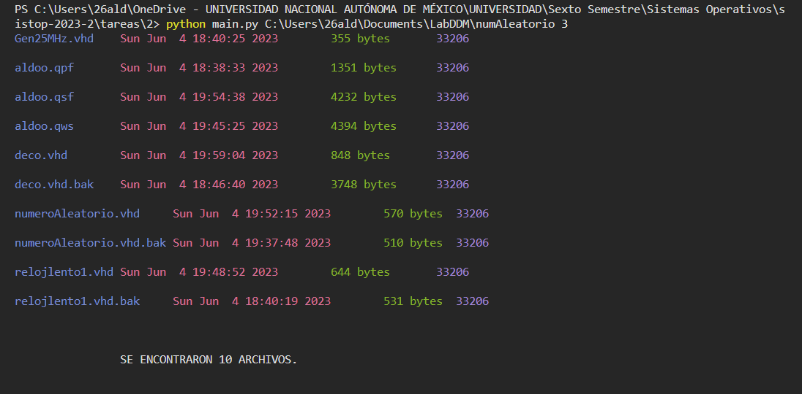
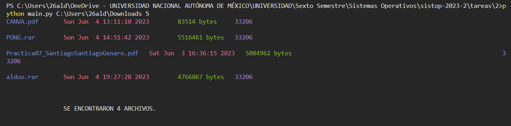

# **Tarea 02. Obteniendo información de un directorio**

## **Integrantes**
- Santiago Alejandro Aldo
- Martinez Lices Christian Jair

## **Funcionamiento del programa**
Al momento de ejectutar desde la terminal, el programa requiere de dos parámetros obligatorios.

***1. PATH:*** Ubicacion del directorio que se requiere analizas.

***2. Dias:*** Número de dias 

*El programa debe abrir el directorio que fue especificado como primer parámetro, e imprimir todos aquellos archivos cuya última modificación tenga el número de días especificado o menos.*

## **Ejemplos**
**1.**

**2.**
